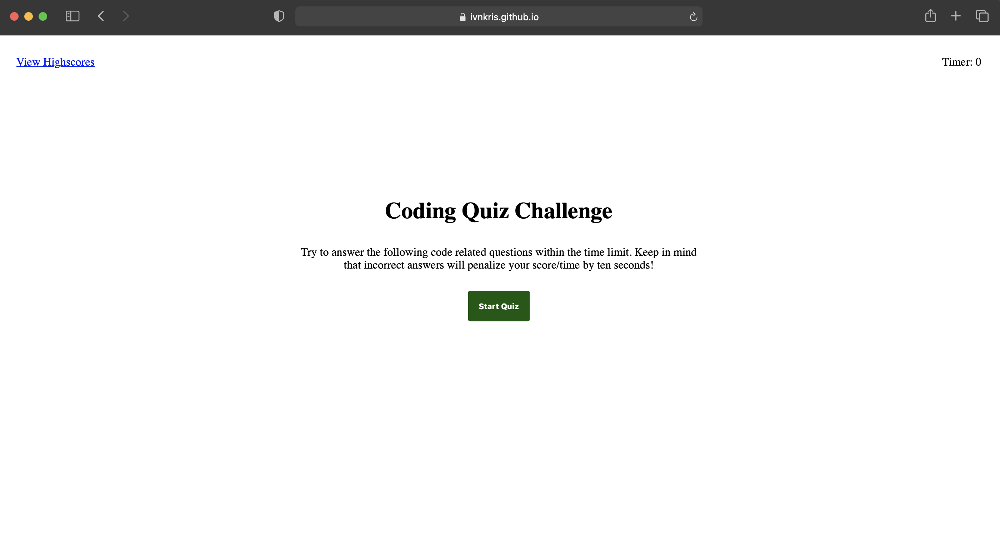
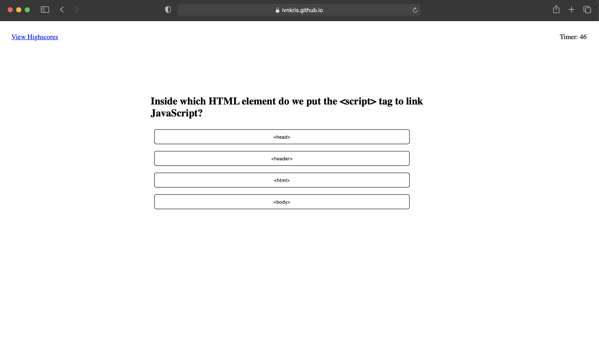
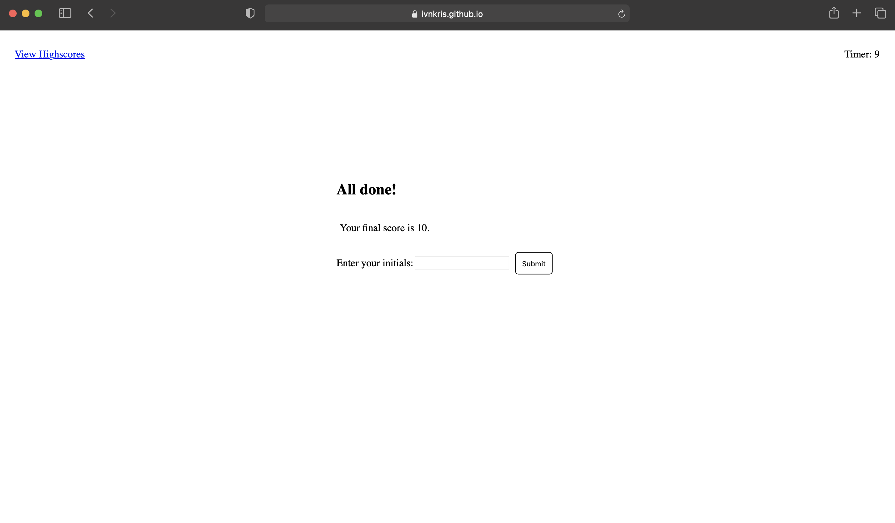
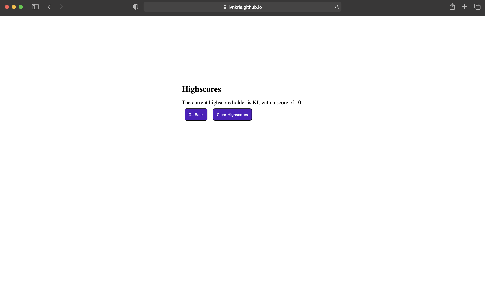
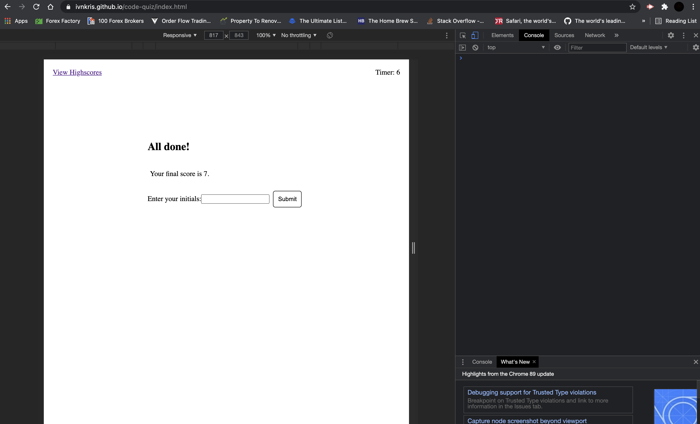
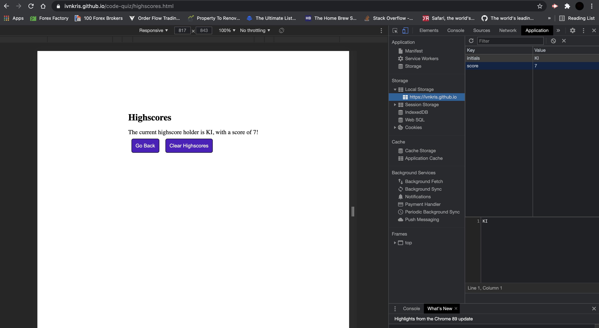

# Code Quiz

## Description

In this project I have created a code quiz with 5 questions. A timer starts when the game is started and for each wrong answer time is deducted. When all questions are answered the leftover time becomes the user's score. The user is prompted to enter their initials and their score is stored in the local storage if it is higher than the previous highscore.

## What I have done

- [x] Created responsible game website with HTML and CSS
- [x] Added logic so that on pressing "Start Quiz" button the original content is removed
- [x] Added an object with the five questions and potential answers
- [x] Added logic that upon starting the game the questions appear. If wrong question is selected the button is highlighted with red and the button of the right answer is highlighted with green. If the right answer is selected the button is highlighted with green
- [x] Added logic for the game to wait one second after an answer is selected so that the user can check if their answer was correct
- [x] Added logic so that a timer is running during the game and time is deducted for each wrong answer
- [x] Added logic so that if each questions were answered or the time runs out a game over page is presented
- [x] On finishing the game the user receives their score and they are prompted to enter their initials
- [x] The highscore is then stored in the local storage if the score is higher than the previous highscore
- [x] On the highscore page the user can view their highscore and can clear the local storage

## Link to Github repository

https://github.com/ivnkris/code-quiz

## Link to deployed application

https://ivnkris.github.io/code-quiz/

## Screenshots

